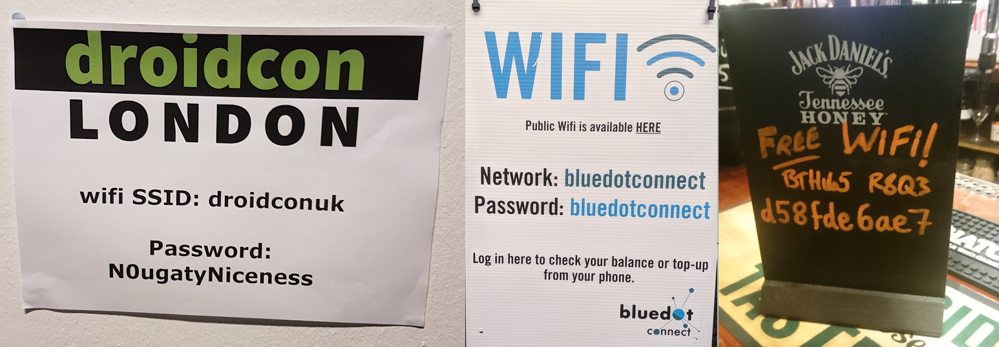

# WireLens

## The Idea

It happens to each and every one of us. We want to get online and when we arrive at a new place are pleased to see they offer free WiFi. They have helpfully printed up the wifi details for us. Something like this:

The problem is, it’s not always convenient to stand there, bring up your phone's wifi settings and carefully type in the password. So you take a picture of the details and then go and sit down to sort it out. But how do you view the image while entering the password? I usually end up trying to memorize chunks of it and switch between the image and the wifi settings. Not ideal to say the least.

Well what if you could take a photo and by the time you sat down, you were already connected to the network? That is what WireLens aims to provide. It uses on-device OCR and machine learning to use the photo combined with info about the wifi networks available to establish the credentials we need and connect automatically. For times when OCR fails - such as when the details are handwritten - WireLens provides an interface that will show you the image overlayed by a text box where you can enter the password manually. These human-provided details can act as inputs to improve the ML component. Once the user has connected to the network, they can tap to show a QR code so others can connect.

So, in the ideal case, we seamlessly connect you after simply taking a photo. In the worst case, we provide a solution to the problem of how to manually enter details from a photograph, with the possibility of using this as an input to improve the machine learning component of the app.

## Bringing it to Life

This is an idea that I started working on in the beginning of 2018 but came up short when I learned that on-device OCR was just not up to the task. Now with MLKit proving so capable, I’m hoping to finally bring the idea to life. It’s an app I constantly find myself wanting as a user, which I find is the best indicator that you’re building something worth making!

### Sample Code
Feel free to explore the code base which is a working (if not yet terribly functional) Android app. 
A few highlights:

* We need to search for common words like "Network" and "Password" and recognise them even if they come through as "Ne7w0rK" or "P4S5w0rd". Fuzzy text matching with specific attetnion to the challenges of OCR is therefore a must. My [FuzzyTextUtils](app/src/main/java/com/elroid/wirelens/util/FuzzyTextUtils.kt) class attempts to do just this by searching for different combinations of commonly confused letters.

* Combining the OCR results with awarenesss of the WiFi landscape requires some complicated logic. The  [ConnectionGuesser](app/src/main/java/com/elroid/wirelens/domain/ConnectionGuesser.java) class is my attempt at making a fully testable process that will ensure that a successful connection happens as quickly as possible.

* For something like this with a complicated rulebase it's important to make sure you don't regress as you add support for different input formats so I made the decision early to make development fully test driven, with [unit tests](/app/src/test/kotlin/com/elroid/wirelens/utils), [business logic tests](app/src/test/kotlin/com/elroid/wirelens/domain) and [UI tests](app/src/androidTest/kotlin/com/elroid/wirelens/test/ui) prioritised.

### Ways Google can help
* I am initially going down the route of fuzzy text matching and rule-based parsing, but I would like to see if there’s a way to bring further machine learning techniques to improve recognition. It occurs to me that there are certain patterns that recur in these passwords such as the habit of creating passwords using words with certain letters replaced by numbers. I’d like to see how machine learning of the structure of passwords could be used to improve password recognition.
* With the changes to wifi capability with Android 10 I could use advice on how best to use the new tools to connect and/or suggest wifi network credentials on current and past platforms

### Timeline
I aim to put out one release each month:

#### 0.5 - MVP (3 January 2020)

* Allows import from camera or gallery with basic image parsing
* Adds guessed connection as a suggested network (Android Q/10+) 
* Basic text output of status (implemented as Foreground Service)

#### 0.6 - Refinement (7 February 2020)
	
* Manual entry screen showing image overlayed with a text box for manual entry
* Shows connection attempts as a list with button to bring up manual entry
* Adds direct connect to WiFi for apps running N/9 and below

#### 0.7 - Add QR code capabilities (6 March 2020)
	
* Adds list of successful WiFi logins with QR-code display
* Add QR code reading function (compatible with Android10 QR codes) 
* Continue to refine rules for different configurations of input 

#### 0.8 - Add ML (3 April 2020)
	
* Start on ML models	
* Add cloud storage of credential images and results for model training
* Refinement of UI, landscape support etc

#### 1.0 - Public Release (1 May 2020)
	
* Add onboarding pages slides and UI polish
* Testing on various devices
* Publish to Google Play

## About Me
I grew up in Silicon Valley, but moved to the UK in my early 20s. I started out doing websites with J2EE but got the mobile dev bug back in 2005. I started out with apps for J2ME/Symbian & Blackberry and I've been creating Android apps for about 10 years now as a freelance consultant. While I enjoy the variety, I do like the idea of seeing a project through its entire lifecycle, so creating my own projects is something I greatly value. I’ve yet to manage to acquire entry to Google IO but would very much appreciate the chance to go back to my homeland to attend. :-)

More about me and projects I' ve been involved with: [elroid.com/cv](http://elroid.com/cv/)
